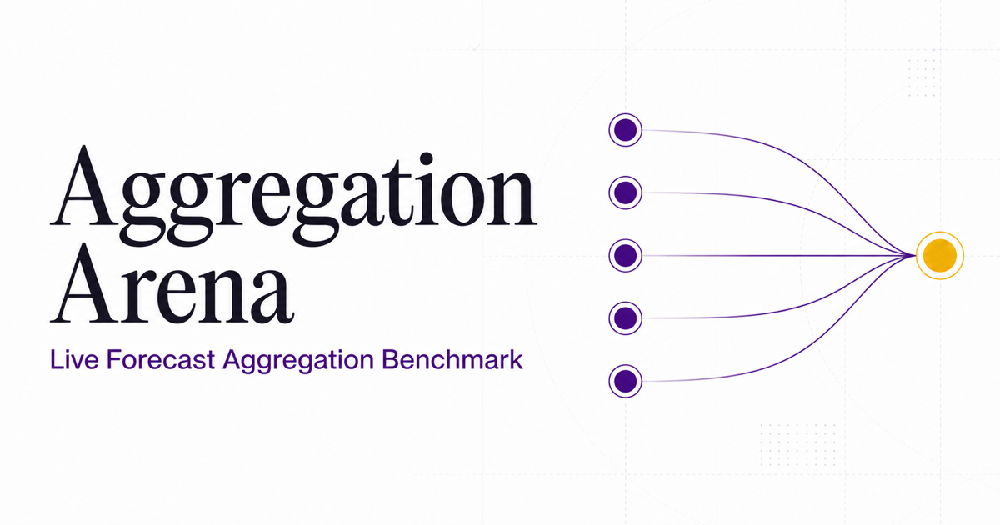

# Aggrena



一个支持 Polymarket + Kalshi 自动选题、共享信息检索、LLM 自动预测、手工概率录入、自动聚合、结果结算、实时排名和审计追踪的预测聚合 Benchmark 平台。

系统每小时从 Polymarket Gamma API 和 Kalshi 公开 Market API 同步活跃市场，应用平台对应的成交活跃度、截止窗口、概率区间和规则完整性筛选。每天优先发布供所有健康模型共同预测的同一组 20 个不同事件。优先选择 Polymarket 10 题、Kalshi 10 题及五个领域各 4 题；来源或类别不足时允许其他合格题补位。系统在平台内部、跨平台和最近 7 天历史之间去除同一现实事件及高度相似题目。先尝试仅用原成交量门槛的题目凑满 20 题，不足时才允许 Polymarket 补位题的 24 小时成交量降至 $1,000，其余质量要求不变。结算后以 Event Brier Score 实时更新 Leaderboard。

生产站点：

<https://www.aggrena.com>

## 目录

- [已经实现的功能](#已经实现的功能)
- [ForecastBench Historical Arena](#forecastbench-historical-arena)
- [完整数据流程](#完整数据流程)
- [LLM 自动预测流水线](#llm-自动预测流水线)
- [聚合方法](#聚合方法)
- [评分与排名](#评分与排名)
- [技术架构](#技术架构)
- [本地安装和运行](#本地安装和运行)
- [如何测试](#如何测试)
- [如何推送到自己的 GitHub](#如何推送到自己的-github)
- [GitHub 与网站部署的区别](#github-与网站部署的区别)
- [数据存储与重置](#数据存储与重置)
- [API](#api)
- [项目结构](#项目结构)
- [当前限制](#当前限制)
- [常见问题](#常见问题)

## 已经实现的功能

### Polymarket + Kalshi 自动选题

- 每小时 `00` 分同时同步 Polymarket Gamma 活跃事件和 Kalshi 公开开放事件；外部请求有 8 秒超时，普通响应上限 2 MiB、批量完整事件上限 8 MiB，并设置来源总量与执行时间预算。
- Polymarket 读取最多 3 页各 100 个常规市场和 1 页 50 个近截止市场，再批量获取最多 48 个完整父事件；Kalshi 按类别发现 series 后有界读取市场，每个来源最多 32 次请求，收到 429 后停止本轮该来源采集。
- 候选 Market 仍先通过严格的 `Yes / No` 质量筛选；入选时按 `source_event_id` 合并为 Event。
- Polymarket 门槛：总成交量至少 `$35,000`、24 小时成交量至少 `$7,500`、流动性至少 `$7,500`，截止时间为 `48 小时–90 天`。
- Kalshi 门槛：总成交量至少 `250` contracts、24 小时成交量至少 `25` contracts，截止时间为 `48 小时–180 天`；由于公开字段的显示 liquidity 常为 0，使用 open interest / quoted size 作为排序深度，不设伪造的 liquidity 硬门槛。
- Yes 概率必须位于 `0.05–0.95`，避免接近确定的题目。
- 有开始时间时，市场至少存在 6 小时。
- 题目说明与结算依据必须有足够文字。
- 与 Prophet Arena 的公开研究设计一致，固定为五类：Politics、Economics、Science、Sports、Entertainment。
- 每日 `00:10 UTC` 生成不可变 20 题批次，优先 Polymarket 10 题 + Kalshi 10 题，供所有健康模型预测相同题单。
- 五类优先各 4 题，来源内每类优先 2 题；来源和类别目标是偏好，可在不足时跨来源、跨类别补齐。
- 先使用符合常规门槛的题目完成 20 题；不足时仅对 Polymarket 补位题允许 24 小时成交量最低 $1,000。总成交量、流动性、截止窗口、市场年龄、概率、完整 outcome 和去重规则不变。若仍不足 20 个独立事件，批次保持 `incomplete`，不发布部分题集。每轮保存策略版本、实际来源/类别分布和补位题数量。
- `incomplete` 或中断在 `running` 的当日批次会在后续成功的整点同步后自动重试，仍使用同一个不可变 run ID。
- 一个 Polymarket Event 每个批次最多入选一次；若它是 `negRisk` 互斥 Event，则保留全部活跃、具名 outcomes，而不是只保留代表 Market。
- 自动忽略 `Company A`、`Person X` 等尚未具名的 augmented negRisk 占位 Market。
- 标题高度相似的市场自动跨平台去重；同一 Kalshi event 下的多个日期或阈值 market 最多入选一个。
- 最近 7 天出现过的同事件或高度相似题目会被拦截。
- 已经入选过的 market 永久不重复选择。
- 入选时保存价格、成交量、流动性、选题分数、类别和批次 ID。
- Curation 页面每 30 秒刷新，显示最近同步、筛选后数量、类别配额和最新题集。
- Pipeline 页面显示自动化健康状态、最后成功同步时间和最近一次运行状态。
- 每轮以有界抓取的完整 Event / 全部 Market 计算门槛和类别统计，但 D1 只持久化至少含一个合格 Market 的 Event，并保留其全部 outcomes，避免无意义的大规模小时写入。
- 超过 20 分钟仍未完成的同步会在下一轮自动标记为 `failed`，不会永久停在 `running`。
- 每小时 `05` 分独立检查全部已选且尚未结算的 Polymarket / Kalshi 事件，不再只检查计划截止时间前 12 小时的题目。
- 事件到达本地 `close_time`，或来源平台提前关闭时，会先从 `open` 变为 `locked` 并立即停止接受预测；来源平台给出明确 outcome 后再变为 `resolved` 并进入评分。
- Forecast 写入入口同时校验事件状态和 `close_time`，即使定时任务延迟，也不会接受计划截止时间之后的预测。

### 事件管理

- 创建 Yes / No 二元预测事件。
- 设置标题、说明、分类、赛季和截止时间。
- 查看开放事件与历史已结算事件。
- 将事件结算为 `Yes` 或 `No`。
- 添加结算说明。
- 作废事件。
- 将事件重新开放。
- 已结算事件进入评分样本，作废事件不参与排名。

### Forecaster 管理

- 创建模型、人类专家或 Crowd Baseline。
- 设置名称、所属组织和展示颜色。
- 在同一事件中为多个 Forecaster 批量输入概率。
- 输入范围固定为 `0–1`。
- 同一个 Forecaster 可以更新仍为 `open` 且尚未到达截止时间的事件概率；`locked` 和 `resolved` 事件均不可修改。

### LLM 自动预测

- 使用 Tavily Basic Search 为每道入选题目检索最多 10 个近期来源。
- 在 Forecast Pipeline 中直接展示全部冻结来源、域名、发布日期、引用状态和原文链接。
- 一道题只检索一次；新闻来源、检索时间，以及来源市场入选时和预测前的价格、成交量、深度双快照冻结到 `research_contexts`。
- 所有当前和未来模型复用完全相同的 Context，避免检索差异污染模型比较。
- 当前注册 13 个具有精确 Cloudflare 路由的 Fixed Context 模型，其中 12 个已通过当前账户计费路径；不使用 Poe，也不使用相近型号替代。
- Prompt 仿照 Prophet Arena：明确题目、结算规则、截止时间、共享来源和市场快照。
- 模型必须为 Event 的每个 outcome key 输出概率、最多三句话的理由和所引用的 Source Rank。
- 系统解析 Prophet 风格的 outcome 数组并归一化到概率 simplex；缺少任何 outcome 时自动重试一次。
- 每次运行完整保存模型、Prompt 版本、原始响应、延迟、引用来源和失败原因。
- 二元预测写入 `predictions`；多 outcome 预测写入 `prediction_outcomes` 和不可变 `prediction_outcome_history`，随后进入 Aggregation 和 Leaderboard。
- Forecasts 页面显示流水线配置、待处理数量、预测结果、理由和冻结证据。
- 每日 `00:20 UTC` 独立处理最多 20 个 model-event 任务；即使整点市场同步失败，模型队列仍会继续处理已有题目。同一 Event 的 12 个当前活跃模型复用同一个 Frozen Context，不会重复调用 Tavily。管理员也可以手工触发下一个任务。

### 聚合计算

每次提交底层概率后，系统会自动重算以下六种方法：

1. Equal Probability Mean
2. Median Forecast
3. Trimmed Mean
4. Log-odds Pool
5. Extremized Mean
6. Performance Weighted

所有方法在同一道题上使用完全相同的 Forecaster Panel。

### 实时 Leaderboard

- 按 Event Brier Score 从低到高排名。
- 可切换 `Aggregators`、`Forecasters` 和 `All`。
- 支持 All time、最近 30 天和最近 90 天窗口。
- 支持按赛季筛选。
- 支持按事件分类筛选。
- 展示平均 Event Brier 和 95% Bootstrap CI。
- 展示 95% Bootstrap Confidence Interval。
- 展示已结算样本数 `N`。
- 展示 Coverage。
- 最少完成 5 个已结算事件后进入正式排名，否则标记为 provisional。
- 客户端每 30 秒自动刷新。
- 支持导出当前 Leaderboard CSV。

### 可审计性

- 当前预测保存在 `predictions`。
- 每次录入或更新同时写入不可变 `prediction_history`。
- 创建事件、提交预测、结算、作废和重新开放都会写入 `audit_log`。
- 审计记录包含时间、操作者、操作类型和实体 ID。
- 生产环境写操作要求登录身份。
- 本地开发允许使用 `local-admin` 身份。

### 界面

- 白色研究工作台视觉风格。
- ForecastBench 紫色与金色强调语义。
- 桌面侧栏导航。
- 手机端底部导航。
- 响应式 Leaderboard、事件列表、方法说明和弹窗。
- 支持键盘 Focus 状态和 Reduced Motion。

## ForecastBench Historical Arena

公开网站导航中的 **Historical Arena** 是独立于 Polymarket + Kalshi 实时榜的历史聚合回测页：

- 数据来自完整 ForecastBench resolved marginal panel 的公开二元事件轨道：1,233,050 条可用预测记录、8,620 个已结算事件、81 个基础模型、11 家模型提供方、25 个预测轮次。除 OpenAI / Anthropic 外，还包括 Google、Meta、DeepSeek、Mistral、Qwen、Moonshot、xAI、Z.ai 和 Minimax。联合信息结构 targets 不混入此公开榜单。
- 用户可以自由勾选要聚合的基础模型；模型集合和模型数 `K` 都是聚合器输入，选择变化后聚合方法、排名和 Performance History 会立即重算。
- 默认且唯一使用 strict-intersection aggregation：只有每个已选模型都提交过预测的事件才进入聚合，所有方法始终共享同一个完整共同样本。
- 历史榜单可在“只看 aggregation methods”和“aggregation methods + 当前所选 individual models”之间切换；两种视图中的每个条目都使用同一严格交集事件集评分。
- 页面显示共同样本的 Events；Coverage、Avg K、available-case 开关以及按实际 K 分组的图表已移除，避免把样本构成差异误读成模型数量效应。
- Past-performance Pool 的权重只使用更早预测轮次的历史 Brier，避免用当前题目的结果训练当前题目。
- 当且仅当选择两个模型时，历史榜增加 **CPTEC**：`p = sigmoid(w × logit(p₁) + (1 − w) × logit(p₂))`。`w` 是第一个已选模型的权重，可在 `0` 到 `1` 间输入，默认 `0.56`；第二个模型自动使用 `1 − w`。该参数同步到 URL 的 `cptec_w`，因此同一回测设置可以直接分享。
- 分类严格沿用 ForecastBench 官方结构：先分为 **Dataset questions** 与 **Market questions**，再按 question set 的官方 `source` 筛选（ACLED、DBnomics、FRED、Wikipedia、Yahoo Finance、Manifold、Metaculus、Polymarket、INFER）。页面不再把本地规则生成的 topic 标签呈现为 ForecastBench 官方分类。
- 每个事件使用 `forecast_due_date + official source + event_id` 连接 question set、resolution 与预测。`event_id` 只在同一 source 内唯一，因此 source 不能从连接键中省略。
- 提供 Prophet Arena 风格的全宽 Performance History，可在累计排名与累计 `1 − Brier` 数值之间切换。
- 当前快照生成脚本为 `scripts/build_forecastbench_history.py`，浏览器数据为 `public/forecastbench/history.json`。重新生成需要本机对应 ForecastBench 研究数据路径。

直接打开：

<https://www.aggrena.com/?view=history>

## 完整数据流程

```text
创建 Forecaster
      ↓
创建事件（手工界面当前为二元）
      ↓
手工输入每个 Forecaster 的 0–1 概率
      ↓
自动生成六种 Aggregation Forecast
      ↓
事件保持 Open，可继续修改概率并保留 History
      ↓
计划截止或来源市场提前关闭 → Locked
      ↓
来源确认最终结果 → Resolved
      ↓
计算每个 Forecaster 与 Aggregator 的 Brier Loss
      ↓
重算 Event Brier、置信区间和 Coverage
      ↓
实时更新 Leaderboard 与 Audit Log
```

自动选题的数据流：

```text
Polymarket Gamma API + Kalshi Market API
      ↓ 每小时同步
平台对应硬筛选：二元 / 成交活跃度 / 截止时间 / 价格 / 规则
      ↓
Prophet Arena 五领域分类 + 综合质量分数排序
      ↓ 每日 00:10 UTC
20 个共享事件；优先 10 + 10 和五类各 4，允许补位；保留 event-family 去重、跨平台语义去重和 7 天重复拦截
      ↓
不可变 selection run，例如 live-2026-08-10-v1
      ↓
写入 Arena events，进入统一预测和聚合流程
      ↓
来源市场明确结算后自动同步结果
      ↓
实时更新 Leaderboard
```

## LLM 自动预测流水线

```text
Daily balanced dual-market release
      ↓
Tavily Basic Search（每道题一次，最多 10 个来源）
      ↓
冻结 Research Context
  ├─ Sources + rank + URL + summary
  ├─ Search query + as-of time
  └─ Source-market price / volume / depth snapshot
      ↓
同一份 Context 分发给所有模型
      ↓
Aggrena Fixed Context 模型注册表（13 个模型）
  ├─ Anthropic / Google / xAI
  └─ Moonshot / Zhipu / DeepSeek / MiniMax
      ↓
Cloudflare AI Gateway / Worker AI binding
      ↓
严格 JSON 解析 + 概率归一化 + 一次格式重试
      ↓
12 个当前活跃基础预测完成
  ├─ Blind Harness：匿名概率 + 严格 pre-event 历史
  └─ Evidence-Aware Harness：冻结证据 + 概率 + rationale
      ↓（同一个 Gateway，失败可重试）
Prediction History → Deterministic + Harness Aggregators → Brier Leaderboard
```

这个实现保留了 Prophet Arena 最重要的实验控制：同一事件的模型必须看到同样的信息来源与市场快照。模型注册表按 Event × Model 生成任务，已有 `context_id` 时直接复用，不能重新搜索。

当前模型注册表于 2026-08-28 修订为 13 个 Cloudflare-only Fixed Context 模型：Gemini 3.6 Flash、Gemini 3.1 Pro、Claude Fable 5、DeepSeek V4 Flash、Claude Opus 4.8、Claude Sonnet 4.6、Grok 4.6、DeepSeek V4 Pro、Kimi K3、Grok 4.5、GLM-5.2、Grok 4.3 和 MiniMax M2.7。切换 Unified Billing 后，DeepSeek V4 Flash 与 GLM-5.2 已通过 `@cf/...` 生产同构 smoke test，线上当前显示 12 个活跃模型；仅持续返回上游 500 的 DeepSeek V4 Pro 暂时熔断。GPT-5.6 Sol 与 GPT-5.5 的 Cloudflare 账户实测仍返回上游 payment error；Inkling 明确要求 BYOK；Qwen 3.6 Plus、Muse Spark 1.1 与 Foresight V3 没有可用的精确 Cloudflare 路由，因此六者从当前注册表退出。不会使用 Poe、Qwen 3.7、Inkling 256K 或其他相近型号冒充这些 individual models。历史预测和成绩保留。Market baseline 和 Agentic predictors 不进入这个模型注册表。

所有 Fixed Context 模型统一使用 `reasoning_profile=medium`，配置版本为 `prophet-fixed-context-v2-medium`。Anthropic adaptive-thinking、xAI、DeepSeek、Kimi 和 GLM 路由在 API 支持时显式发送对应的 medium effort 字段；不提供推理档位参数的精确型号保持供应商默认推理方式，但不会发送可能被供应商拒绝的伪造参数。该版本写入每条 `model_forecast_runs.prompt_version`，避免不同推理预算的预测被静默混用。

### 调用量

- Tavily 免费账户每月 1,000 API Credits；Basic Search 每次 1 Credit。
- 每日发布 20 题，每题搜索一次，30 天约使用 `20 × 30 = 600 Credits`。
- 每个启用模型都预测同一批 20 个不同事件。当前 12 个模型的每日目标是 `20 × 12 = 240` 条完整入库的 event-model 预测；20 不是全体模型合计的调用量。
- `00:10 UTC` 发布每日题集；每小时 `:20` 最多处理 20 个 event-model jobs，并发 2。失败、漏写和仍开放的跨天任务可以续跑。单批有 8 分钟取消预算、20 分钟互斥租约；单次模型请求 90 秒、搜索 30 秒。瞬时上游失败最多重试 3 次，格式解析最多 2 轮，因此每日目标不是 API 调用硬上限。
- Agent Harness 自动聚合当前暂停，不产生新的定时模型调用；历史 Harness 结果和实现代码保留。
- 每个来源摘要最多 1,800 字符；输出与推理预算按精确模型协议配置。模型费用由 Cloudflare Gateway 后面的实际供应商决定。

### 配置 API 密钥

先在 <https://app.tavily.com> 获取 Tavily Key。所有模型调用都使用 Cloudflare AI Gateway 和 Worker 的 `AI` binding，不保存供应商 API Key，也不配置 Poe。不要把任何 Key 写入 `wrangler.jsonc`、README、Git commit 或前端代码。

在正确的 Cloudflare 账户登录后执行：

```bash
npx wrangler login
npx wrangler whoami
npx wrangler secret put TAVILY_API_KEY
```

生产配置使用 `PROPHET_MODEL_GATEWAY_MODE=cloudflare-only`。13 个注册模型和 Qwen 3.7 Plus agent harness 都必须在 `PROPHET_CLOUDFLARE_MODEL_ID_MAP` 中具有明确 Cloudflare 路由；缺少映射会直接报错，不会自动回退到外部网关。当前由 `PROPHET_DISABLED_MODEL_IDS` 临时熔断 DeepSeek V4 Pro。

逐型号路由、请求协议与下线决策见 [`docs/cloudflare-model-audit-2026-08-24.md`](docs/cloudflare-model-audit-2026-08-24.md)。型号替换必须显式更名并保留审计记录。

12 个当前活跃基础预测模型、Blind Harness 和 Evidence-Aware Harness 共用 Cloudflare 路由；Harness 调用 Cloudflare 的 `alibaba/qwen3.7-plus`，但它不属于 individual forecasters。模型显示名、participant ID、ranking 和 score calculation 不随底层路由改变。

应用不会用相近型号静默替代。若某个 Cloudflare 精确路由调用失败，该 model-event 会记录为 `failed`，其他模型继续运行；维护者应修复或下线该精确路由，而不是把另一型号冒充成原模型。

`PROPHET_DISABLED_MODEL_IDS` 只用于临时熔断仍在注册表中的型号；当前为 `deepseek-v4-pro`。旧 participant IDs 位于 retired 列表，历史 individual-model scores 仍保留。

两种 Harness 会在同一个事件的全部 active exact models 完成后自动运行（当前为 12 个）。Gateway 的网络错误、超时或上游错误会记录为可重试的 `failed`，不会永久替换为聚合结果；只有两次成功请求都返回无法解析的权重 JSON 时，才会记录 equal-mean fallback。已解决事件的维护者回填允许从至少两个完整基础预测开始。

本地开发先复制 [`.dev.vars.example`](.dev.vars.example) 为 `.dev.vars` 再填入真实值；`.dev.vars` 已被 Git 忽略。部署后打开网站的 `Pipeline` 页面查看配置状态，也可以在 `Forecasts` 页面检查模型任务。配置正常时可等待每小时 `:20 UTC` 的预测 Cron，或登录后点击 `Run next forecast`。Individual Models 的 `Today (UTC)` 显示每个模型当天题集的实际入库数 `/ 20`；`Resolved / live` 是累计事件状态，`Awaiting outcome` 说明预测已保存、事件尚未结算。

生产环境若需要立即发布当日题集并执行一批最多 20 个模型任务，可由维护者使用仅存于
Cloudflare Secret 的 `PIPELINE_ADMIN_TOKEN` 调用 `run_daily_forecast_batch`。
该操作会复用当天不可变 selection run，多次调用不会重复发布题目。
同一密钥还可以调用 `run_pipeline_sync`，用于运维人员立即执行一次与整点 Cron 相同的同步和结算检查。

每次整点市场同步都会补建缺失的每日题集、重试失败或不完整的选题。选题使用最近 3 小时内成功采集的数据，必须满足 20 个不同真实事件及标题去重；优先 Polymarket 10 + Kalshi 10、五类各 4，不足时按上述补位门槛完成题单，仍不够则记录阻断原因，不发布伪造或部分题集。写入 20 题与 completed 状态属于同一数据库事务。维护者也可通过同账户显式绑定的私有 `PipelineAdminEntrypoint` 执行 sync/select/forecast；该入口没有公共 HTTP 路由，不能用未鉴权请求替代后台授权。

### 本地测试限制

单元测试覆盖模型面板、Gateway payload、Model ID override、Query、Source 去重、Prompt、JSON 解析和概率校验。真实搜索与模型端到端测试需要配置 Tavily 与 Gateway，并会产生外部 API 费用，因此不会在普通 `npm test` 中自动执行。

选题配置在 [`lib/curation-core.js`](lib/curation-core.js)，数据同步和定时任务在 [`lib/polymarket.ts`](lib/polymarket.ts)。修改门槛时应同时升级 `configVersion`，这样历史批次仍然可以解释。

## 聚合方法

### 1. Equal Probability Mean

所有 Forecaster 概率的算术平均：

```text
p_agg = mean(p_1, p_2, ..., p_n)
```

这是最直接的概率聚合基线。

### 2. Median Forecast

使用概率中位数，降低少数极端概率对结果的影响。

### 3. Trimmed Mean

当 Forecaster 数量足够时，去掉概率序列两端的值后求平均；样本较少时退化为普通平均。

### 4. Log-odds Pool

先将每个概率转换为 Log-odds，在 Log-odds 空间求平均，再转换回概率：

```text
logit(p) = log(p / (1 - p))
p_agg = logistic(mean(logit(p_i)))
```

系统会对接近 `0` 或 `1` 的概率做数值截断，避免无限 Log-odds。

### 5. Extremized Mean

先计算 Equal Mean，再在 Log-odds 空间乘以 `1.2`：

```text
p_ext = logistic(1.2 × logit(mean(p_i)))
```

该方法会把聚合结果适度推离 `0.5`。

### 6. Performance Weighted

使用每个 Forecaster 在此前已结算事件上的历史 Brier 表现计算权重。

为避免早期小样本产生极端权重，系统为每个 Forecaster 加入五个 Brier 为 `0.25` 的虚拟观测：

```text
shrunk_brier =
  (historical_brier_sum + 5 × 0.25)
  / (historical_event_count + 5)

weight = 1 / max(0.04, shrunk_brier)
```

当前事件的真实结果不会进入当前事件的权重计算，权重只使用此前已经结算的数据。

## 评分与排名

### Prophet Event Brier Score

一个 Event 有 `K` 个互斥且穷尽的 outcomes。模型提交概率向量 `p₁…pₖ`，实际结果使用 one-hot 向量 `y₁…yₖ`：

```text
Event Brier = (1 / K) × Σₖ (pₖ - yₖ)²
Leaderboard Score = mean(Event Brier over resolved events)
```

Event Brier 越低越好。二元题是 `K=2` 的特例；平台不再显示 Brier Index。

### 95% Confidence Interval

平台对每个排名对象的 Event Brier 做 500 次确定性 Bootstrap，直接报告平均 Event Brier 的 95% 区间。

### Coverage

Coverage 表示某个 Forecaster 或聚合方法在当前筛选样本中拥有有效预测的事件比例。

### 重要研究口径说明

当前版本采用 Prophet Arena 风格的事件级多 outcome Brier，不是 ForecastBench 官方复现中的 difficulty-adjusted Brier，也没有加入事件固定效应。

## 技术架构

- Next.js 16
- React 19
- TypeScript
- Vinext / Vite
- Cloudflare Worker-compatible runtime
- Cloudflare D1 / SQLite
- Drizzle ORM
- Tailwind CSS 基础工具与自定义 CSS
- Node.js 内置 Test Runner
- ESLint
- Cloudflare Workers 定时任务

生产数据与本地数据相互独立：

- 本地开发使用 Wrangler 的本地 D1。
- 生产网站使用 `wrangler.jsonc` 绑定的 ChengPeng 账户 D1。
- `aggrena.com` 使用现有的 `aggregation-arena-production` D1 数据库。
- Git 仓库不包含任何 D1 数据文件。

## 本地安装和运行

### 1. 前置条件

需要安装：

- Git
- Node.js `22.13.0` 或更高版本
- npm

检查版本：

```bash
git --version
node --version
npm --version
```

推荐使用 Node.js 22 LTS。

### 2. 进入项目目录

```bash
cd /path/to/aggrena
```

### 3. 安装依赖

```bash
npm install
```

依赖版本已经锁定在 `package-lock.json`。在 CI 或需要严格复现时可以使用：

```bash
npm ci
```

### 4. 启动开发服务器

```bash
npm run dev
```

终端会打印本地 URL，通常为：

```text
http://localhost:3000
```

首次访问 `/api/arena` 时，系统会：

1. 建立本地 D1 表。
2. 检查是否已有数据。
3. 如果数据库为空，初始化 Demo Season、示例 Forecaster 和示例事件。

### 5. 停止服务器

在运行开发服务器的终端按：

```text
Control + C
```

## 如何测试

建议分成四层测试：静态检查、自动化测试、手工 UI 测试和可选 API 测试。

### 第一层：代码检查

```bash
npm run lint
```

预期结果：

- ESLint 退出码为 `0`。
- 没有 Error。

### 第二层：完整自动化测试

```bash
npm test
```

该命令会先执行生产构建，然后运行测试。

当前自动化测试覆盖：

1. Cloudflare Worker 生产构建可以真实启动并返回 Aggrena 页面。
2. 三 outcome Event 的 Prophet Event Brier 公式和概率 simplex 归一化正确。
3. 代码中存在并实现六种确定性聚合方法。
4. 低成交量和非二元市场会被硬筛选拒绝。
5. 每个类别最多选择配置规定的题目数，单一热门类别不能占满题集。
6. 同源市场会去重，缺少合格题时不会用弱题补齐。

预期结果：

```text
tests 6
pass 6
fail 0
```

### 第三层：单独验证生产构建

```bash
npm run build
```

预期路由：

```text
/             Dynamic page
/api/arena    Dynamic API
```

`npm test` 已经包含一次构建，因此日常修改后通常运行 `npm run lint && npm test` 即可。

### 第四层：手工 UI 闭环测试

启动开发服务器后，在浏览器中完成以下流程：

1. 打开 `Events`。
2. 点击 `+ Add forecaster`，创建至少三个 Forecaster。
3. 点击 `+ New event`，创建一个测试事件。
4. 在事件行点击 `Input probabilities`。
5. 为至少三个 Forecaster 输入不同的 `0–1` 概率。
6. 提交后打开事件详情，确认出现六个 Aggregate Forecast。
7. 点击 `Resolve`，选择 `Yes` 或 `No` 并提交。
8. 返回 `Leaderboard`，确认：
   - Resolved 数量增加。
   - 所有 Aggregator 的 `N` 增加。
   - Event Brier 和 95% CI 更新。
   - 排名重新排序。
9. 打开 `Audit log`，确认出现创建题目、提交预测和结算记录。
10. 点击 `Export CSV`，确认当前排名可以导出。
11. 打开 `Curation`，确认能看到同步状态、五类配额和最新不可变批次。

建议同时验证以下边界：

- 概率小于 `0` 或大于 `1` 时应被拒绝。
- 少于两个 Forecaster 时不能结算为正式聚合样本。
- 已结算事件不能继续提交预测。
- 切换 Season、Category、30d 和 90d 后排名样本应改变。
- 手机宽度下应显示底部导航。

### 可选：API 健康检查

开发服务器运行时：

```bash
curl "http://localhost:3000/api/arena?track=aggregators&window=all&season=all&category=all"
```

预期返回包含以下字段的 JSON：

```text
generatedAt
stats
leaderboard
events
participants
methods
seasons
categories
activity
methodology
curation
```

本地环境允许写操作使用 `local-admin`。生产环境没有登录身份时，写请求会返回 `401`。

## 如何推送到自己的 GitHub

GitHub 在这里用于保存源码、提交历史和协作，不等于把网站运行在 GitHub Pages。

下面提供 GitHub CLI 和网页两种方法。任选一种即可。

### 方法 A：使用 GitHub CLI，推荐

#### 1. 安装 GitHub CLI

macOS：

```bash
brew install gh
```

验证：

```bash
gh --version
```

#### 2. 登录 GitHub

```bash
gh auth login
```

推荐选择：

```text
GitHub.com
HTTPS
Login with a web browser
```

完成后检查：

```bash
gh auth status
```

#### 3. 检查本地仓库

在项目根目录执行：

```bash
git status -sb
git branch --show-current
git log -3 --oneline
git remote -v
```

当前项目的默认分支应为 `main`。

项目可能已经有一个名为 `sites` 的远程仓库，它用于现有生产部署。不要删除或覆盖它。GitHub 远程仓库应命名为 `origin`。

#### 4. 创建私有 GitHub 仓库并推送

```bash
gh repo create aggrena \
  --private \
  --source=. \
  --remote=origin \
  --push
```

该命令会：

1. 在当前登录的 GitHub 账号下创建私有仓库。
2. 将本地仓库设置为源码来源。
3. 添加名为 `origin` 的 GitHub Remote。
4. 将当前 `main` 分支推送到 GitHub。

如果希望公开源码，将 `--private` 改为 `--public`。在公开前请重新检查仓库中是否有不希望公开的研究材料或配置。

#### 5. 验证推送

```bash
git remote -v
git status -sb
gh repo view --web
```

正常情况下会同时看到：

```text
origin  GitHub repository
sites   Sites deployment repository
```

### 方法 B：通过 GitHub 网页创建仓库

#### 1. 创建空仓库

打开：

<https://github.com/new>

填写：

- Repository name: `aggrena`
- Visibility: `Private`

不要勾选以下选项：

- Add a README file
- Add `.gitignore`
- Choose a license

本地项目已经有这些文件和 Git 历史。如果 GitHub 先生成一个提交，首次推送会出现历史冲突。

#### 2. 添加 GitHub Remote

HTTPS：

```bash
git remote add origin https://github.com/YOUR_USERNAME/aggrena.git
```

或者 SSH：

```bash
git remote add origin git@github.com:YOUR_USERNAME/aggrena.git
```

把 `YOUR_USERNAME` 替换成你的 GitHub 用户名。

#### 3. 推送

```bash
git push -u origin main
```

#### 4. 验证

```bash
git remote -v
git status -sb
```

然后刷新 GitHub 仓库页面。

### 以后如何提交更新

每次修改后：

```bash
git status
git diff
git add <本次修改的文件>
git commit -m "Describe the change"
git push origin main
```

不要在不清楚文件范围时机械使用 `git add -A`。先用 `git status` 和 `git diff` 确认没有把本地数据库、实验文件或无关资料一起提交。

### 常用 GitHub 检查

```bash
# 当前分支
git branch --show-current

# 最近提交
git log --oneline -5

# 所有远程仓库
git remote -v

# 本地是否领先或落后 GitHub
git status -sb

# GitHub 登录状态
gh auth status

# 打开当前 GitHub 仓库
gh repo view --web
```

## GitHub 与网站部署的区别

### GitHub Repository

负责：

- 保存源码。
- 保存 Git Commit 历史。
- Issue、Pull Request 和代码审查。
- GitHub Actions 自动化测试。

### GitHub Pages

只适合静态 HTML、CSS 和 JavaScript。

本项目不能直接使用 GitHub Pages 完整运行，因为它依赖：

- `/api/arena` 服务端 API。
- Cloudflare Worker Runtime。
- D1 数据库。
- 生产环境登录身份 Header。

把源码推到 GitHub 不会自动更新当前生产网站。

### 当前生产部署

公开线上版本由 Cloudflare Workers 承载，并使用 D1 和 Cron Triggers。`.openai/hosting.json` 对应的 Sites 项目可作为独立预览环境。

源码修改后的标准流程是：

```text
修改代码
→ npm run lint
→ npm test
→ Git Commit
→ Push 到 GitHub
→ 对生产 D1 应用 Migration
→ 部署 Cloudflare Worker
```

在已登录正确 Cloudflare 账号的环境中：

```bash
npx wrangler whoami
npx wrangler d1 migrations apply aggregation-arena-production --remote
npx wrangler deploy
```

部署会注册四个相互隔离的 UTC 定时任务：

- `0 * * * *`：每小时同步候选市场，并重试尚未完成的每日选题。
- `5 * * * *`：每小时独立检查结算，避免与候选同步共用请求数预算。
- `10 0 * * *`：每日发布新的均衡题集。
- `20 * * * *`：每小时处理最多 20 个 model-event 预测任务，直至所有启用模型覆盖当日 20 道题；12 个模型每天目标共 240 条真实预测。

Agent Harness 的自动 Cron 当前未注册；历史结果与手工维护代码保留。

必须先检查 `wrangler whoami` 的账号和目标 D1 ID。当前生产目标是 ChengPeng 账户与 `aggregation-arena-production`。

## 数据存储与重置

### 本地数据

Wrangler 本地 D1 数据保存在被 `.gitignore` 排除的 `.wrangler/` 目录中，不会上传到 GitHub。

需要重置本地数据时，先停止开发服务器，再将本地状态目录移动到备份：

```bash
mv .wrangler ".wrangler.backup.$(date +%Y%m%d-%H%M%S)"
npm run dev
```

重新访问网站后会建立新的本地数据库并再次初始化 Demo Season。

### 生产数据

生产 D1 不在 Git 仓库中。以下操作不会自动删除生产数据：

- 删除本地 `.wrangler`。
- 重新安装 `node_modules`。
- 推送 GitHub。
- 重新 Clone 仓库。

修改数据库 Schema 后：

```bash
npm run db:generate
```

然后检查 `drizzle/` 中生成的 Migration，确认无误后再提交和部署。

## API

统一端点：

```text
GET  /api/arena
POST /api/arena
```

### GET 查询参数

| 参数 | 可选值 | 默认值 |
|---|---|---|
| `track` | `aggregators`, `forecasters`, `all` | `aggregators` |
| `window` | `all`, `30d`, `90d` | `all` |
| `season` | 赛季名称或 `all` | `all` |
| `category` | 分类名称或 `all` | `all` |

### POST Actions

| Action | 用途 |
|---|---|
| `create_participant` | 创建或更新 Forecaster |
| `create_event` | 创建二元事件 |
| `submit_forecasts` | 批量提交手工概率并重算聚合 |
| `resolve_event` | 结算 Yes / No |
| `invalidate_event` | 作废事件 |
| `reopen_event` | 重新开放事件 |

所有 POST 请求使用 JSON Body：

```json
{
  "action": "create_event",
  "title": "Will the event happen?",
  "description": "Resolution criteria",
  "category": "Science",
  "season": "Season 1",
  "closeTime": "2026-12-31T12:00:00.000Z"
}
```

生产写请求必须带有 Sites 身份网关提供的 `oai-authenticated-user-email`。不要在公网部署中自行伪造或信任来自未受保护代理的该 Header。

## 项目结构

```text
aggrena/
├── app/
│   ├── api/arena/route.ts    # GET Snapshot 与 POST Actions
│   ├── arena-client.tsx      # Leaderboard、事件、方法和审计 UI
│   ├── globals.css           # 白色主题和响应式设计
│   ├── layout.tsx            # Metadata 与社交分享配置
│   └── page.tsx              # 页面入口
├── db/
│   ├── index.ts              # D1 / Drizzle 连接
│   └── schema.ts             # 数据表定义
├── drizzle/                  # 数据库 Migration
├── lib/
│   └── arena.ts              # 聚合、评分、Bootstrap 和业务逻辑
├── public/
│   └── og.png                # GitHub README 与社交分享图
├── tests/
│   ├── rendered-html.test.mjs
│   └── scoring.test.mjs
├── .openai/
│   └── hosting.json          # Sites 项目与逻辑 D1 Binding
├── package.json
└── README.md
```

### 核心数据表

| 表 | 用途 |
|---|---|
| `participants` | Forecaster 元数据 |
| `events` | 事件、状态和结算结果 |
| `event_outcomes` | Event 的稳定 outcome key、名称、Market 和入选快照 |
| `predictions` | 每个事件的最新预测版本 |
| `prediction_history` | 不可变预测历史 |
| `prediction_outcomes` | 多 outcome Event 的当前概率向量 |
| `prediction_outcome_history` | 多 outcome 概率向量的不可变历史 |
| `audit_log` | 操作审计记录 |
| `polymarket_candidates` | Polymarket + Kalshi 统一候选存储、来源、diversity group、筛选结果和淘汰原因（保留旧表名兼容现有 D1） |
| `market_snapshots` | 合格市场的小时级价格和流动性快照 |
| `curation_sync_runs` | 每次双市场同步及分来源健康状态的运行记录 |
| `selection_runs` | 不可变的每日选题批次 |
| `selection_items` | 批次内题目及入选时快照 |

## 当前限制

- 手工创建和手工概率录入界面目前仍以 Yes / No 为主；Polymarket 自动流水线支持多 outcome Event，Kalshi 当前按独立二元 Market 接入。
- 当前 11 个活跃自动 Predictor 共享同一份 frozen evidence，但分别独立推理；Cloudflare 必须提供当前面板的全部精确 model route。
- 自动结算分别读取 Polymarket 的最终 outcome 价格和 Kalshi 的官方 `result` 字段；只有明确结果才写入 Arena。
- 固定分类器使用标签和关键词；低置信度的边界题仍可能需要后续人工审核。
- 不支持连续结果或数值预测评分；多 outcome 必须互斥且穷尽。
- 没有 difficulty-adjusted Brier 或事件固定效应。
- Performance Weighted 只基于平台内部已结算历史。
- 当前身份模型依赖 Sites 私有访问网关，不是完整的多角色权限系统。
- 事件使用作废而不是永久删除，以保留审计轨迹。
- 自动化测试覆盖核心构建与评分契约，但尚未覆盖所有表单交互和所有 API 错误分支。

## 常见问题

### `gh: command not found`

macOS：

```bash
brew install gh
```

然后：

```bash
gh auth login
```

### `gh auth status` 显示未登录

重新运行：

```bash
gh auth login
```

选择 GitHub.com，并使用浏览器完成授权。

### `remote origin already exists`

先检查：

```bash
git remote -v
```

如果 `origin` 已经指向正确仓库，不要重复添加，直接：

```bash
git push -u origin main
```

如果指向错误仓库，先确认目标地址，再修改：

```bash
git remote set-url origin https://github.com/YOUR_USERNAME/aggrena.git
```

### GitHub 仓库创建后第一次 Push 被拒绝

通常是因为在 GitHub 网页创建仓库时同时生成了 README、License 或 `.gitignore`。最简单的处理方式是删除刚创建且没有重要内容的远程仓库，重新创建一个完全空的仓库，然后再次 Push。

不要为了绕过冲突直接执行 `git push --force`，除非已经确认远程提交可以被覆盖。

### 本地端口 3000 被占用

停止占用端口的旧开发服务器，或根据开发服务器输出使用其他端口。不要同时让两个开发实例写入同一份本地 D1。

### 页面一直显示 `Preparing benchmark`

依次检查：

1. 运行 `npm run dev` 的终端是否有错误。
2. 浏览器 Network 中 `/api/arena` 是否返回 `200`。
3. Node.js 是否满足 `>=22.13.0`。
4. `.wrangler` 本地状态是否损坏。

如需排除本地数据库问题，先按“数据存储与重置”章节备份 `.wrangler`，再重启开发服务器。

### 修改代码后 GitHub 更新了，但生产网站没变化

这是正常的。GitHub 保存源码，Sites 负责生产运行。需要额外保存并部署新的 Sites Version。

## 推荐开发检查清单

每次准备提交前：

```text
[ ] git status 和 git diff 只包含本次修改
[ ] npm run lint 通过
[ ] npm test 显示 3 pass / 0 fail
[ ] 手工创建事件并提交概率成功
[ ] 结算后 Leaderboard 正确更新
[ ] Audit log 出现相应操作
[ ] 没有提交 .wrangler、本地数据库或环境变量
[ ] Commit 信息说明本次改动
[ ] Push 到正确的 GitHub origin
```
